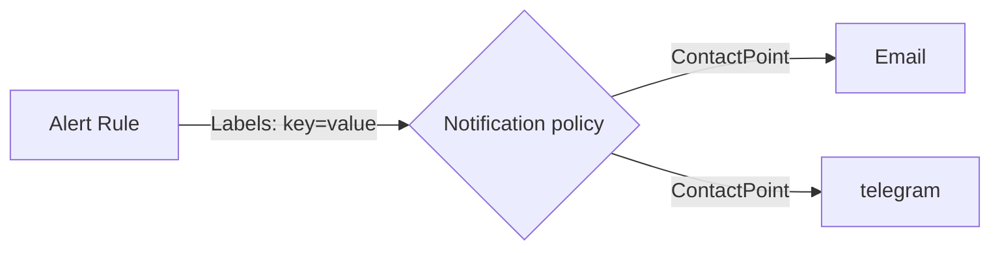

# Prometheus Operator

Helm Chart: 

https://github.com/prometheus-community/helm-charts/tree/main/charts/kube-prometheus-stack

install:

```bash
$ helm repo add prometheus-community https://prometheus-community.github.io/helm-charts

$ helm repo update
$ helm install [RELEASE_NAME] prometheus-community/kube-prometheus-stack \
  -n monitor --create-namespace \
  -f ./prometheus-operator/override-values.yaml 
```

版本資訊:

- Chart Version: kube-prometheus-stack-48.1.1
- APP Version: v0.67.0

upgrade: 更新過程中若有任何異狀導致更新失敗，將目前相關 CRDs 移除，由 upgrade or install 重新自動安裝。

```bash
kubectl delete crd alertmanagerconfigs.monitoring.coreos.com
kubectl delete crd alertmanagers.monitoring.coreos.com
kubectl delete crd podmonitors.monitoring.coreos.com
kubectl delete crd probes.monitoring.coreos.com
kubectl delete crd prometheusagents.monitoring.coreos.com
kubectl delete crd prometheuses.monitoring.coreos.com
kubectl delete crd prometheusrules.monitoring.coreos.com
kubectl delete crd scrapeconfigs.monitoring.coreos.com
kubectl delete crd servicemonitors.monitoring.coreos.com
kubectl delete crd thanosrulers.monitoring.coreos.com
```

## kube-state-metrics

可以取得k8s上的metrics, 設定一個ingress(ingress-prom-operator-kube-stack-metrics.yaml) expose 出來比較方便

## values file (kube-prometheus-stack-values.yaml)

### coredns or kubedns

兩者擇一，目前GKE使用 kubedns

### prometheus

`overrid-values.yaml` 新增修改以下設定:

    - prometheus.ingress.enabled: true
    - prometheus.ingress.annotations: 
        nginx.ingress.kubernetes.io/rewrite-target: /$1
    - prometheus.ingress.hosts: <prometheus url>
    - prometheus.ingress.paths: /(.*)
    - prometheus.ingress.pathType: Prefix
    - prometheus.prometheusSpec.externalUrl: http://<prometheus url>/

### grafana

#### Basic Setting

`overrid-values.yaml` 新增修改以下設定:

    - (自己新增)grafana.adminUser: <admin username>
    - grafana.adminPassword: <admin password>
    - (自己新增)grafana.ini 內容
    - grafana.ingress.enabled: true
    - grafana.ingress.annotations:
        nginx.ingress.kubernetes.io/rewrite-target: /$1
    - grafana.ingress.hosts: <grafana url>
    - grafana.ingress.path: /(.*)
    - grafana.sidecar.dashboards.folderAnnotation: grafana_folder
    - grafana.sidecar.dashboards.provider.foldersFromFilesStructure: true

grafana dashboard 用 sidecar 的方式 import，需要自己建立 ConfigMap
    - configmap-helloworld.yaml

特別需要注意的是，ConfigMap 的 label 需要有 `grafana_dashboard: "1"`，`grafana_dashboard` 這個設定在 sidecar.dashboards.label，grafana-sc-dashboard 這個container會去看 ConfigMap, 只要有這個 label，就會 mount 在 grafana，預設的路徑位於 `/tmp/dashboards`

#### Alerting
Alert Rule Flow


alert 相關設定皆在 grafana.alerting{...}, 另外拉出 `override-values-grafana-alert.yaml` 撰寫
